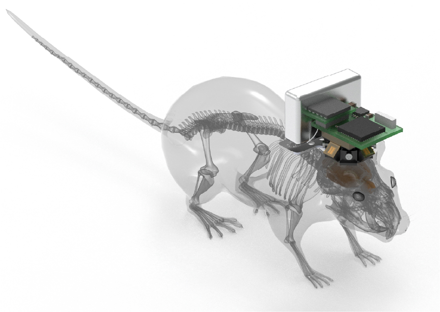
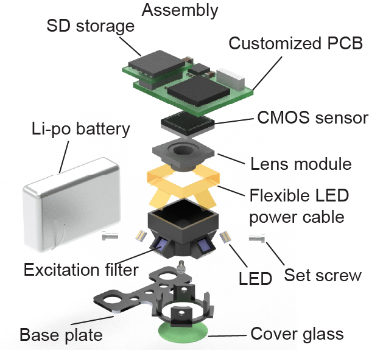

# Airscope

**A 1-gram wireless mesoscope for cortex-wide, single-cell-resolution imaging during unrestricted behaviour**

<p align="center">
  
</p>


Airscope is an open hardware and software resource for wireless mesoscopic
calcium imaging in freely behaving mice. The platform combines a compact optical
head, wireless acquisition electronics, embedded firmware, host acquisition
software, and analysis pipelines for large-field-of-view neural imaging and
behavioural quantification.

<p align="center">
  
</p>


This repository accompanies the manuscript:

> **Deciphering cortex-wide neural dynamics of naturally behaving mice by a
> 1-gram wireless mesoscope**

Airscope provides a 6 mm field of view at approximately 4 micrometre lateral
resolution, streams or logs 1600 x 1200 pixel images at 10 Hz, and weighs
approximately 1 g. The resource is intended to support reproduction of the
device, acquisition of wireless calcium-imaging data, and analysis of
cortex-wide neural dynamics during naturalistic, social, aquatic, and
multi-organ behavioural paradigms.

## Repository Scope

The repository contains the design files, acquisition software, firmware,
processing code, behavioural-analysis tools, and example data associated with
the Airscope release.

| Component | Directory | Contents |
| --- | --- | --- |
| Mechanical design | [`Structure/`](./Structure) | SolidWorks assemblies and part files for the Airscope housing, baseplate, optical mount, main PCB carrier, and flexible LED board. |
| Optical design | [`Zemax/`](./Zemax) | Zemax files for the aspheric optical module. |
| Electronics | [`Electronics/`](./Electronics) | KiCad projects for the main PCB and auxiliary flexible or extension boards. |
| Firmware | [`Firmware/`](./Firmware) | Embedded code for wireless control, camera acquisition, peripheral management, and device configuration. |
| Host acquisition | [`DAQ_software/`](./DAQ_software) | Windows installer and dependency-free Python host software for device discovery, preview, control, and recording. |
| Analysis software | [`Software/`](./Software) | Calcium-imaging processing, neural decoding, and multi-animal segmentation pipelines. |
| Released data | [`Data_release/`](./Data_release) | Optical-characterisation images, MCU timestamp data, example experiment metadata, visualization notebooks, and data-download instructions. |

## System Capabilities

- **Wide-field cellular imaging.** Airscope records cortex-wide fluorescence
  videos over a 6 mm field of view with single-cell spatial resolution.
- **Untethered operation.** Wireless data transfer and on-board logging support
  freely moving behaviour in large, complex, and multi-animal environments.
- **Integrated acquisition stack.** Host software communicates with the device
  firmware for discovery, control, preview, timestamping, and recording.
- **Reproducible calcium processing.** The calcium-imaging pipeline provides
  motion correction, optical preprocessing, learned background removal, neuron
  segmentation, trace extraction, and quality-control outputs.
- **Behavioural and social analysis.** The software release includes SAM2Mice
  for multi-animal segmentation and tracking, and Neuron-BERT models for
  decoding social-interaction outcomes from dual-animal neural activity.

## Documentation

Detailed build instructions and software documentation are maintained separately:

- Device assembly, acquisition, and operation:
  <https://airscope.org/devkit/>
- Processing pipelines, notebooks, and examples:
  <https://airscope-docxs.readthedocs.io/en/latest/>

The module-level `README.md` files in each software directory contain the most
specific installation commands and usage examples.

## Software Modules

### Airscope calcium-imaging processing

[`Software/Airscope_ca_processing`](./Software/Airscope_ca_processing) contains
the primary calcium-imaging analysis pipeline. It supports image sequences,
TIFF stacks, and MP4 input, and is configured through Hydra for reproducible
batch processing.

Core stages include:

- frame loading and optional bad-frame replacement;
- motion correction with Suite2p-style or CaImAn-style configurations;
- distortion and intensity preprocessing;
- learned background rejection and vessel-aware filtering;
- patch-wise neuron segmentation;
- export of ROI masks, calcium traces, and neuron centroids.

Typical installation:

```bash
cd Software/Airscope_ca_processing
conda create -n PICO python=3.10
conda activate PICO
pip install -r requirements.txt
pip install -e .
```

Typical execution:

```bash
airscope-process \
  data_path=/path/to/session/frames \
  out_path=/path/to/session/analysis \
  rmbg.gpu_ids=0 \
  rmbg.multi_gpu=false
```

The main downstream files are usually `seg_results_filtered.mat`,
`infer_results_filtered.mat`, and `cm_filtered.mat`.


### SAM2Mice

[`Software/SAM2Mice`](./Software/SAM2Mice) extends the SAM 2 video segmentation
framework for mouse segmentation and tracking. It supports manual prompts,
YOLOv11-generated prompts, and bootstrapped inference for long videos that
cannot be loaded into GPU memory in a single pass.

Typical installation:

```bash
cd Software/SAM2Mice
pip install torch==2.6.0 torchvision==0.21.0 torchaudio==2.6.0 --index-url https://download.pytorch.org/whl/cu124
pip install -e ".[notebooks]"
python setup.py build_ext --inplace
```

The notebook series in
[`Software/SAM2Mice/notebooks_SAM2-MICE`](./Software/SAM2Mice/notebooks_SAM2-MICE)
demonstrates basic video segmentation, long-video bootstrapping, automatic
tracking, public-dataset examples, and advanced video-object-segmentation
workflows.

## Host Acquisition Software

The Python host software can be run without external Python dependencies:

```bash
cd DAQ_software/airscope_pybackend
python server.py
```

The server starts a local user interface at `http://127.0.0.1:8765/`, maintains
a registry of discovered Airscope devices, and responds to firmware timestamp
requests over UDP. A packaged Windows installer is also provided at
[`DAQ_software/airscope.msi`](./DAQ_software/airscope.msi).

## Data Release

The public data release is documented in
[`Data_release/README.md`](./Data_release/README.md) and hosted on Google Drive:

<https://drive.google.com/drive/folders/1z9ibX8Ob2NnCdjQDHI7Z4tdhdspn647B?usp=drive_link>

Released materials include:

- enriched-habitat recordings with synchronized behavioural videos, detection
  boxes, arena annotations, neural activity, cortical labels, and neuron
  centroids;
- multi-animal interaction recordings with behavioural videos, SAM2 instance
  masks, aligned neural activity, cortical labels, neuron centres, and mouse
  trajectory data;
- MCU timestamp files for frame-rate validation;
- USAF 1951 target images and fluorescent grid images for optical
  characterisation.

Each dataset directory contains a dataset-specific `README.md` and a
`visualize_data.ipynb` notebook.


## Requirements

Requirements differ by component. In brief:

- host acquisition software: Python 3.9 or later, standard library only;
- calcium processing: Linux, Python 3.10, CUDA-enabled PyTorch recommended;
- SAM2Mice: Python 3.11, PyTorch 2.6.0, CUDA 12.4 used in the demonstration
  environment;
- Neuron-BERT: PyTorch, NumPy, scikit-learn, pandas, matplotlib, seaborn, tqdm,
  and Jupyter.

Refer to the component-level README files for exact commands, checkpoints, and
configuration options.

## Code Availability

This repository provides the design and software files required to reproduce
the principal Airscope hardware and computational workflows. The code is
organised as independent modules so that users can run the acquisition,
calcium-processing, behavioural-segmentation, and neural-decoding components
separately.

Third-party dependencies, licences, and notices are described in
[`LICENSE`](./LICENSE), [`NOTICE.md`](./NOTICE.md), and the corresponding
module-level files. In particular,
[`Software/Airscope_ca_processing`](./Software/Airscope_ca_processing) is
released under the GNU General Public License v2.0 only, and
[`Software/SAM2Mice`](./Software/SAM2Mice) retains its Apache-2.0 licence and
third-party notices.

## Data Availability

Example and supplementary datasets are available through the Google Drive links
listed in [`Data_release/README.md`](./Data_release/README.md). Large raw data
files are not stored directly in the git repository.

## Licensing

Airscope is distributed as a multi-licence repository. Unless a file or
subdirectory states otherwise:

| Material | Licence |
| --- | --- |
| Hardware design files in `Structure/`, `Electronics/`, and `Zemax/` | CERN-OHL-S-2.0 |
| Original Airscope software in `DAQ_software/`, `Firmware/`, and `Software/Neuron_BERT/` | Apache-2.0 |
| Calcium-processing software in `Software/Airscope_ca_processing/` | GPL-2.0-only |
| SAM2Mice software in `Software/SAM2Mice/` | Apache-2.0 |
| Documentation, figures, notebooks, and released data | CC-BY-4.0 |

See [`LICENSE`](./LICENSE), [`LICENSES/`](./LICENSES), and
[`NOTICE.md`](./NOTICE.md) for the authoritative directory-level licence map
and third-party notices.

## Citation

If you use Airscope hardware files, software, or released data, please cite the
associated manuscript:

```bibtex
@article{airscope2025,
  title   = {Deciphering cortex-wide neural dynamics of naturally
             behaving mice by a 1-gram wireless mesoscope},
  author  = {Zhang, Yuanlong and Li, Angran and Yuan, Lekang and
             Wang, Mingrui and Zhao, Weihao and Wang, Zhenbo and
             Zang, Boyang and Zhou, Yangxuan and Yu, Tao and Gao, Lin
             and Wu, Yu and Zhu, Rongkang and Tian, Mengyi and Li, Kun
             and Wu, Jiamin and Dai, Pu and Dai, Qionghai},
  journal = {Nature},
  year    = {2025},
  note    = {Manuscript in preparation}
}
```

## Contact

Questions, bug reports, and suggestions can be submitted through the issue
tracker or sent to the corresponding authors listed in the manuscript.
