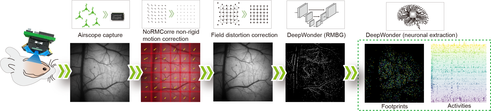

# Airscope calcium imaging processing

Official processing code for Deciphering cortex-wide neural dynamics of naturally behaving mice by 1-gram wireless mesoscope.

<p align="center">
  
</p>
Airscope_ca_processing processes sequential imaging frames through motion correction,preprocessing, background removal, neuron segmentation, and trace export.

- End-to-end processing pipeline for cortex-wide PICO calcium imaging.
- Suite2p-style or CaImAn-style motion correction configs.
- Learned background removal and vessel-aware filtering.
- Hydra-based configuration for reproducible batch processing.
- Exported masks and traces for downstream analysis.

## Installation

The tested environment is Linux with Python 3.10 and CUDA 11.8.

```bash
conda create -n PICO python=3.10
conda activate PICO
pip install -r requirements.txt
pip install -e .
```

Check the installation:

```bash
python - <<'PY'
import torch
import Airscope_ca
print("Airscope_ca import OK")
print("torch:", torch.__version__, "cuda:", torch.version.cuda)
print("cuda available:", torch.cuda.is_available())
PY
```

## Checkpoints

Download the checkpoint files from:

[[`Google Drive`](https://drive.google.com/drive/folders/1UuLxzTA0PmYvqz8UPbQ9a1BIXx_mHZjt?dmr=1&ec=wgc-drive-%5Bmodule%5D-goto)]

Place the downloaded files under the repository-level `ckpt/` directory:

```text
ckpt/
  CorrectionMap.npz
  deepdefinite_ckpt_resize_2.pth
  vessel_model.pt
  yolo_v8s.pt
```

The default configs expect these paths. If you store the files elsewhere, update the corresponding config values under `configs/`.

## Input Format

The pipeline supports `jpg`, `tif`, and `mp4` inputs through `data_format`.
For image sequences, use grayscale frames named by frame index:

```text
data/session/frames/
  frame_0.jpg
  frame_1.jpg
  frame_2.jpg
  ...
```

For TIFF input, use the same naming pattern with `.tif`. For MP4 input, set
`data_path` to the MP4 file path, or to a directory containing exactly one
`.mp4` file. The number of frames is inferred from `data_format` unless
`set_frame_num` is provided.

## Running

Run the full pipeline:

```bash
airscope-process \
  data_path=/path/to/session/frames \
  out_path=/path/to/session/analysis \
  rmbg.gpu_ids=0 \
  rmbg.multi_gpu=false
```

For a short smoke test:

```bash
airscope-process \
  data_path=/path/to/session/frames \
  out_path=/tmp/pico_smoke_test \
  set_frame_num=100 \
  rmbg.gpu_ids=0 \
  rmbg.multi_gpu=false \
  save_debug_video=false
```

Common overrides:

| Override | Description |
| --- | --- |
| `data_path` | Input frame directory for `jpg`/`tif`, or MP4 path for `mp4` |
| `data_format=jpg/tif/mp4` | Select input format |
| `out_path` | Output directory |
| `set_frame_num` | Limit the number of processed frames; `0` infers all frames |
| `motion=caiman` / `motion=suite2p` | Select motion correction config |
| `rmbg.gpu_ids=0,1` | Select GPUs for background removal |
| `rmbg.multi_gpu=true` | Enable multi-GPU background removal |
| `jump_to_rmbg=true` | Reuse existing motion/preprocessing outputs |
| `jump_to_seg=true` | Reuse existing background-removed output |
| `save_debug_video=false` | Disable debug AVI export |


Typical outputs include:

```text
Analysis/
├── log_file.log
├── badframe_replaced.avi                    # optional raw-frame QC video
├── mc/
│   ├── motion_corrected.zarr                # motion-corrected calcium movie
│   ├── suite2p_shifts.png                   # rigid x/y shift diagnostic
│   ├── suite2p_refImg.png                   # registration reference image
│   └── suite2p_refImg.npy                   # numeric reference image
├── preprocess/
│   └── video_preprocessed.zarr              # distortion/intensity corrected movie
├── rmbg/
│   └── rmbg.zarr                            # neuron-enhanced movie after background removal
├── vessel_image.tif                         # vessel-channel image used for exclusion
├── vessel_mask.tif                          # raw vessel mask
├── vessel_mask.png                          # vessel-mask QC figure
├── vessel_mask_clean.tif                    # small-component cleaned vessel mask
├── vessel_mask_dilate.tif                   # dilated vessel mask used for ROI filtering
└── seg_results_thresh_pmap_<value>/
    ├── patch_<row>_<col>/                   # patch-level segmentation workspace
    ├── seg_results.mat                      # unfiltered ROI masks
    ├── infer_results.mat                    # unfiltered calcium traces
    ├── cm.mat                               # unfiltered ROI center coordinates
    ├── SEG_SUM.png                          # unfiltered summed ROI mask
    ├── cm.png / cm.svg                      # unfiltered ROI-center plot
    ├── seg_results_filtered.mat             # vessel/shape filtered ROI masks
    ├── infer_results_filtered.mat           # filtered calcium traces
    ├── cm_filtered.mat                      # filtered ROI center coordinates
    ├── SEG_SUM_filtered.png                 # filtered summed ROI mask
    ├── cm_wo_vessel.png / cm_wo_vessel.svg  # filtered ROI-center plot
    ├── neuron_mask.png / neuron_mask.svg    # filtering summary overlay
    └── Neuron_trace/
        ├── whole_neurons.png
        └── <start>_to_<end>.png             # trace panels by ROI block
```

The final files used for downstream calcium analysis are usually
`seg_results_filtered.mat`, `infer_results_filtered.mat`, and `cm_filtered.mat`.

## Notebooks

Interactive QC notebooks are provided for each processing stage (motion correction, preprocessing, background removal, segmentation, and export). See [`notebooks/README.md`](notebooks/README.md) for demo data download, path setup, and the full stage map.

## Configuration

Configs are stored in `configs/`. The top-level config is:

```text
configs/config.yaml
```

Default groups:

```text
configs/motion/
configs/preprocessing/
configs/rmbg/
configs/segmentation/
```

Hydra overrides can be passed directly on the command line.

## Citation

If this code is useful for your work, please cite:

```text
Yuanlong Zhang, Angran Li, Lekang Yuan, Mingrui Wang.
Deciphering cortex-wide neural dynamics of naturally behaving mice by 1-gram wireless mesoscope.
```

See `CITATION.cff` for machine-readable citation metadata.

## License

This repository is released under the GNU General Public License v2.0 only. See `LICENSE`.
