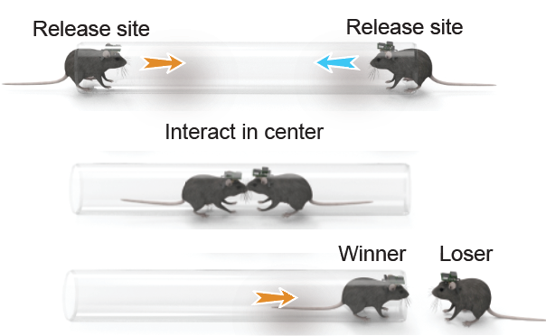
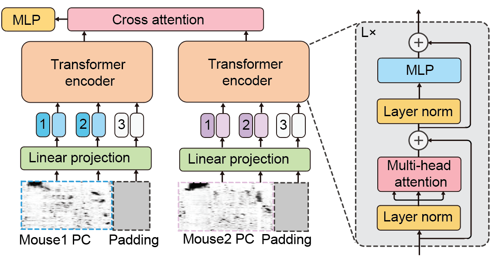
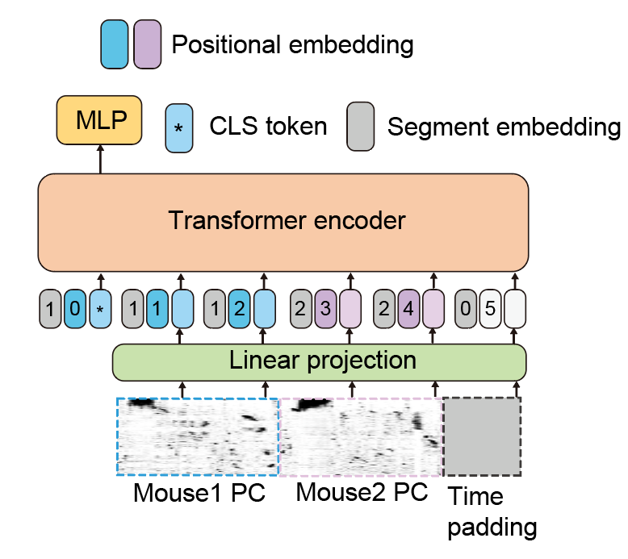

# 🧠 Neuron-BERT predictor

We proposed a deep learning framework for analyzing calcium imaging data from dual-mouse behavioral experiments using two-stream neural architectures.  Neural recordings were tokenized in time, treating each time point as a token. The sequence from each animal, without rank labels, was passed to a dedicated transformer encoder to produce an embedded representation of that animal’s activity.This repository implements multiple model architectures including Uni-stream BERT and Dual-stream-BERT predicting the tubetest outcome (win/lose) from neural calcium signals.





## 🏗️ Model Architectures


Calcium imaging sequences are high‑dimensional, noisy, and socially contextual. Classical models (SVM / shallow MLP) ignore structured temporal dependencies and inter‑animal coupling. A BERT‑style encoder can be like:

| Challenge | Solution (This Repo) |
|-----------|----------------------|
| Irregular neural co‑activation | Multi‑head self‑attention over time |
| Social interaction dependency | Dual encoders + cross‑attention |
| Limited labeled trials | Augmentations + masking style robustness |
| Variable trial lengths | Cropping / padding + sequence masking |

---


### 1. Dual‑Stream BERT

Two independent temporal Transformer encoders (one per mouse) followed by a fusion head.

Fusion options:
- `concat` (default): feature concatenation + MLP.
- `add`: element‑wise combination (parameter‑efficient).
- `cross_attention`: symmetrical cross‑attention module learns directed inter‑mouse influence before fusion.

### 2. Neuron‑BERT (Single Stream)

Adapts a BERT encoder to neural calcium sequences with:
- Learned positional embeddings
- LayerNorm + GELU feed‑forward blocks
- CLS token–style representation aggregation (classification head on first token)

---

## 📦 Data Format

Each experiment file (e.g. `data_aligned.pkl`) is a pickled Python dict:

```python
{
  'trial_folder_name (mouseA_mouseB)': {
      'start_frame': int,
      'end_frame': int,
      'neuron_center_{mouse_id}': np.ndarray,          # (num_neurons, 2) or similar
      'neuron_name_{mouse_id}': np.ndarray | list,     # optional metadata
      'calcium_whole_{mouse_id}': np.ndarray,          # (num_neurons, total_time)
      'trial_{k}': {
          'winner': str,                               # e.g. 'mouseA'
          'time_start_end': np.ndarray,                # [t_start, t_end]
          'calcium_{mouse_id}': np.ndarray             # (num_neurons, trial_time)
      }
  },
  ...
}
```

### Preprocessing Assumptions
- Trials are already **aligned** across the two animals.
- PCA dimensionality reduction happens inside dataset classes when caching (see `datasets/`).
- Variable length trials are cropped / padded to a fixed `--seq_length` with a corresponding mask.

---

## 🔧 Installation

Minimal setup (adjust torch version for CUDA):

```bash
pip install torch torchvision torchaudio --index-url https://download.pytorch.org/whl/cu121  # or cpu
pip install scikit-learn numpy matplotlib seaborn pandas tqdm jupyter
```

---


## ▶️ Quick Start (Defaults)

Single‑stream:
```bash
python train_BERT.py --data_dir <path_to_pickled_data>
```

Dual‑stream:

```bash
python train_dual_stream_BERT.py --data_dir <path> --fusion_strategy cross_attention --depth 4 --embed_dim 256
```

---

⚙️ Key CLI Arguments

| Category | Argument | Purpose | Common Values |
|----------|---------|---------|---------------|
| Data | `--data_dir` | Folder of `.pkl` dictionaries | (required) |
| Splitting | `--split_strategy` | How to partition trials | `trial_level`, `mouse_level`, `file_level` |
| Sequence | `--seq_length` | Crop/pad length (time tokens) | 196 / 392 |
| Dimensionality | `--input_dim` | PCA dimension | 128 / 256 |
| Architecture | `--depth` | Transformer layers | 2–6 |
| Architecture | `--num_heads` | Attention heads | 4 / 8 |
| Fusion (dual) | `--fusion_strategy` | Feature integration | `concat`, `add`, `cross_attention` |
| Training | `--batch_size` | Batch size | 16 / 32 |
| Training | `--lr` | Learning rate | 1e-3 (dual), 1e-4 (single) |
| Training | `--epochs` | Epoch count | 20+ (dual), 100 (single) |
| Regularization | `--drop_ratio` | Dropout | 0.1–0.3 |
| Augmentation | see below | Robustness to noise | tuned per dataset |

Run `python train_dual_stream_BERT.py -h` or `python train_BERT.py -h` for the full list.

---

🧪 Data Augmentation Toolkit

Implemented inside dataset classes (`dataset_augment.py`). You can toggle intensity via probabilities:

| Augmentation | Args | Effect |
|--------------|------|--------|
| Random crop | `--no_random_crop` (flag disables) | Focuses model on sub‑segments; combats overfitting on edge padding |
| Channel shuffle | `--channel_shuffle_prob`, `--channel_shuffle_ratio` | Reorders subset of neuron channels (simulates ROI ordering ambiguity) |
| Channel dropout | `--channel_dropout_prob`, `--channel_dropout_ratio` | Zeros subset of channels (missing neuron simulation) |
| Time masking | `--time_mask_prob`, `--time_mask_ratio` | Random temporal spans masked (encourages temporal redundancy reasoning) |

All augmentations automatically disabled for validation and test splits.

---

## 📊 Results (Five‑Fold Cross Validation)

Performance across nine animal pairs (19 held‑out trials per fold):

| Model | Accuracy | Precision | Recall | F1 |
|-------|----------|-----------|--------|----|
| SVM | 53.45 ± 5.38 | 41.39 ± 24.90 | 76.00 ± 43.36 | 53.48 ± 31.50 |
| MLP | 67.24 ± 8.16 | 94.64 ± 7.36 | 40.44 ± 22.99 | 52.84 ± 20.21 |
| Neuron_BERT (shared) | 66.25 ± 8.39 | 62.62 ± 12.78 | 75.28 ± 25.85 | 66.98 ± 17.40 |
| Two_stream_BERT | **81.82 ± 6.92** | **83.39 ± 3.88** | **81.11 ± 14.93** | **81.62 ± 9.08** |

---

## 📚 Citation

If this repository aids your research, please cite:

```bibtex
@software{two_stream_predictor,
  title        = {Two-Stream Calcium Imaging Predictor},
  author       = {Neurallabware},
  year         = {2025},
  url          = {https://github.com/Neurallabware/two_stream_predictor}
}
```

---

## 📄 License
MIT License (see `LICENSE`).

---


