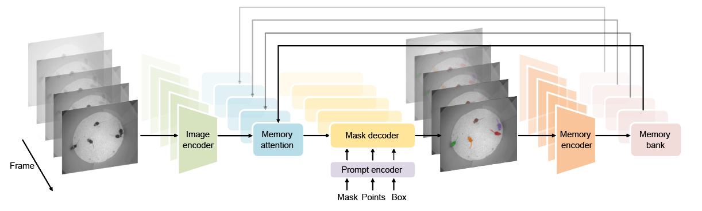
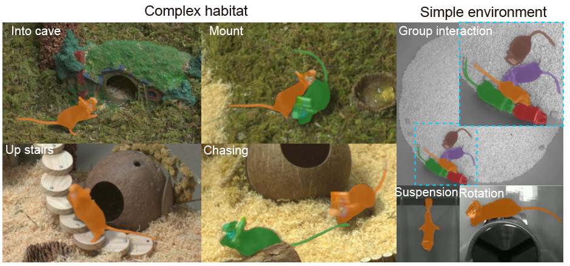
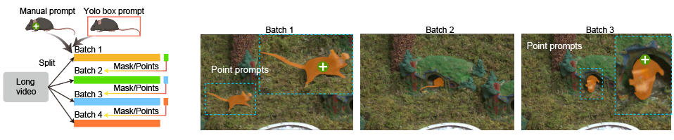
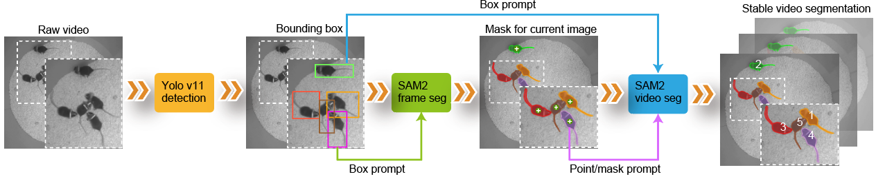
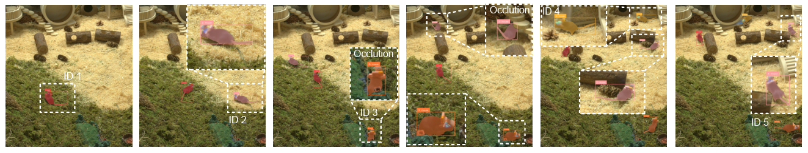

# SAM2Mice: Zero-Shot Multi-Animal Semantic Segmentation

[[`SAM 2 Paper`](https://arxiv.org/abs/2408.00714)] [[`YOLO v11 Paper`](https://www.arxiv.org/abs/2410.17725)] [[`BibTeX`](#citation)]

**SAM2Mice** extends the SAM 2 video segmentation framework for multi-animal mouse segmentation and tracking. It combines SAM2Mice checkpoints, YOLOv11 prompt generation, manual SAM2 prompt workflows, and bootstrapped long-video inference.

Highlights:

- Curated multi-mouse segmentation data with diverse camera views and environments.
- Bootstrapping inference for long videos that cannot be loaded into GPU memory at once.
- Benchmarking support against DeepLabCut and SuperAnimal using MOT metrics.

<p align="center">
  
</p>

<p align="center">
  
</p>

## Quick Start

Create or activate a Python environment first. We use `python=3.11`, `torch>=2.6.0`, `torchvision>=0.21.0`, and CUDA 12.4 in our demo environment.

```bash
pip install torch==2.6.0 torchvision==0.21.0 torchaudio==2.6.0 --index-url https://download.pytorch.org/whl/cu124
pip install -e ".[notebooks]"
python setup.py build_ext --inplace
```

Download the SAM2Mice checkpoint:

```bash
cd checkpoints
bash download_ckpts.sh
cd ..
```

Download the YOLOv11 detector checkpoint:

```bash
cd checkpoints_detection
bash download_ckpts.sh
cd ..
```

The YOLO checkpoint is intended for top-down open-field videos. You can also download the SAM2Mice checkpoint directly from [Google Drive](https://drive.google.com/file/d/1aTYiL1qt23vUAGbHvh2Yrk3r16i95bnU/view?usp=drive_link).

## Notebooks

Run the notebooks in order if you are new to the project:

| Order | Notebook | Purpose |
| --- | --- | --- |
| 1 | [`01_basic_video_segmentation.ipynb`](./notebooks_SAM2-MICE/01_basic_video_segmentation.ipynb) | Manual prompts and YOLO-generated prompts on one video. |
| 2 | [`02_bootstrapping_long_video.ipynb`](./notebooks_SAM2-MICE/02_bootstrapping_long_video.ipynb) | Long-video segmentation with bootstrapped frame batches. |
| 3 | [`03_auto_tracking_dynamic_ids.ipynb`](./notebooks_SAM2-MICE/03_auto_tracking_dynamic_ids.ipynb) | Automatic tracking with dynamic IDs. |
| 4 | [`04_public_datasets_demo.ipynb`](./notebooks_SAM2-MICE/04_public_datasets_demo.ipynb) | Public mouse behavior dataset examples. |
| 5 | [`05_vos_inference_advanced.ipynb`](./notebooks_SAM2-MICE/05_vos_inference_advanced.ipynb) | Advanced VOS inference utilities. |

Demo data can be downloaded from [Google Drive](https://drive.google.com/drive/folders/1h3JZ6n-LhZRwAsLCKLH60XWioy7f3WPZ). See [`docs/google_drive_data.md`](./docs/google_drive_data.md) for the full folder structure and per-file Drive IDs.

## Manual Prompts

Manual SAM2 prompts are saved as LabelMe-compatible `.json` files next to extracted frames. SAM2Mice supports two prompt creation tools:

- **LabelMe desktop GUI**: use this when you have a local graphical desktop or X11 forwarding.
- **SAM2-Mice browser prompt tool**: use `launch_annotator` on a remote server or headless workstation.

See the standalone manual prompt guide: [`docs/prompts/README.md`](./docs/prompts/README.md).

## Inference Workflows

SAM2Mice supports two prompt sources:

- `manual`: read LabelMe-style `.json` prompt files from the frame directory.
- `detection`: use YOLOv11 to generate prompts automatically.

When using `prompt_source="detection"`, the supported `prompt_type` values are `box`, `point`, and `mask`.

Results are automatically saved as a gzip-compressed pickle (`segment_masks.pickle`) in `save_dir`. See [`docs/results_pkl.md`](./docs/results_pkl.md) for save/load and re-rendering details.

### Basic Video Segmentation

<details>
<summary><b>Manual prompts (point)</b></summary>

Extract frames and launch the browser-based GUI annotator to place point prompts on the first frame, then run segmentation:

```python
from SAM2_Mice.segmentation import VideoSegmentationInference
from SAM2_Mice.utils import launch_annotator

model_cfg = "configs/sam2.1/sam2.1_hiera_b+.yaml"
checkpoint_path = "checkpoints/SAM2_Mice_base_plus.pt"
video_path = "data/test_video.mp4"
frames_dir = "data/frames"

predictor = VideoSegmentationInference(
    model_cfg=model_cfg,
    checkpoint_path=checkpoint_path,
)

predictor.extract_frames_before_seg(
    video_path=video_path,
    frame_dir=frames_dir,
)

# Launch GUI to annotate the first frame; saves a LabelMe-compatible .json prompt file
launch_annotator(frames_dir=frames_dir)

predictor.run(
    video_path=None,
    frames_dir=frames_dir,
    prompt_source="manual",
    prompt_type="point",
    save_dir="results/base",
    fps=20,
)
```

</details>


### Bootstrapping Long Videos

Processing high-resolution long videos with the standard SAM 2 video predictor can be GPU-intensive because all frames are loaded into memory. SAM2Mice bootstrapping splits the video into overlapping frame batches and carries prompts forward through the shared boundary frame.



<details>
<summary><b>Manual prompts (point)</b></summary>

Extract batched frames, annotate the first frame with the GUI, then run bootstrapped segmentation:

```python
from SAM2_Mice.segmentation import BootstrappingVideoSegmentationInference
from SAM2_Mice.utils import launch_annotator

model_cfg = "configs/sam2.1/sam2.1_hiera_b+.yaml"
checkpoint_path = "checkpoints/SAM2_Mice_base_plus.pt"
video_path = "data/test_video.mp4"
frames_dir = "data/bootstrap_frames"
batch_size = 300

predictor = BootstrappingVideoSegmentationInference(
    model_cfg=model_cfg,
    checkpoint_path=checkpoint_path,
)

predictor.extract_bootstrapping_frames(
    video_path=video_path,
    batch_size=batch_size,
    batch_save_dir=frames_dir,
)

# Launch GUI to annotate the first frame of the first batch
launch_annotator(frames_dir=frames_dir)

predictor.run_bootstrapping(
    video_path=None,
    frames_dir=frames_dir,
    frame_interval=batch_size,
    extract_frame=False,
    prompt_source="manual",
    prompt_type="point",
    detection_frame_idx=0,
    detection_ckpt_path="checkpoints_detection/yolo11l_openfield_five_mice.pt",
    save_dir="results/bootstrapping",
    fps=20,
)
```

</details>


### YOLO Prompt Generation

YOLOv11 can generate the first-frame prompts automatically:

- `box`: use detector boxes directly.
- `point`: sample points from SAM2 masks predicted from detector boxes.
- `mask`: use SAM2 masks predicted from detector boxes.



> **Note:** The YOLO detector is trained on SAM2Mice masks from a specific recording setup (top-down open-field view). It works best when the new video matches that setup closely. For new environments or camera angles, re-train a YOLO detector on SAM2-generated masks from a short representative clip of the new recording — see [`training/README.md`](./training/README.md).

Set `prompt_source="detection"` in either the basic or bootstrapping workflow to use this mode.

<details>
<summary><b>YOLO automatic prompts (point)</b></summary>

Use YOLOv11 to generate point prompts automatically from the first frame — no manual annotation needed:

```python
from SAM2_Mice.segmentation import VideoSegmentationInference

model_cfg = "configs/sam2.1/sam2.1_hiera_b+.yaml"
checkpoint_path = "checkpoints/SAM2_Mice_base_plus.pt"
video_path = "data/test_video.mp4"
frames_dir = "data/frames"

predictor = VideoSegmentationInference(
    model_cfg=model_cfg,
    checkpoint_path=checkpoint_path,
)

predictor.extract_frames_before_seg(
    video_path=video_path,
    frame_dir=frames_dir,
)

predictor.run(
    video_path=None,
    frames_dir=frames_dir,
    prompt_source="detection",
    prompt_type="point",
    detection_ckpt_path="checkpoints_detection/yolo11l_openfield_five_mice.pt",
    save_dir="results/base",
    fps=20,
)
```

</details>

### Auto-Tracking with Dynamic IDs

This mode integrates YOLOv11 detection with SAM2Mice segmentation for prompt-free multi-animal tracking and dynamic ID assignment. It is still under development and may be less stable than the standard workflows.



<details>
<summary><b>Code</b></summary>

```python
from SAM2_Mice.segmentation import auto_tracking_with_sam2

auto_tracking_with_sam2(
    video_path="data/test_video.mp4",
    frames_dir="data/frames",
    output_dir="results/tracking",
    sam2_checkpoint="checkpoints/SAM2_Mice_base_plus.pt",
    model_cfg="configs/sam2.1/sam2.1_hiera_b+.yaml",
    detection_ckpt_path="checkpoints_detection/yolo11l_openfield_five_mice.pt",
    prompt_type="mask",
    frame_step=1,
    frame_rate=20,
    detection_conf=0.5,
    iou_threshold=0.3,
    extract_frames=True,
    object_label="mouse",
)
```

</details>

## Training

Training data preparation, SAM2Mice fine-tuning, and YOLOv11 detector training are documented in [`training/README.md`](./training/README.md).

## Benchmark

Tracking metric evaluation and comparisons with DeepLabCut and SuperAnimal are documented in [`SAM2_Mice/benchmark/README.md`](./SAM2_Mice/benchmark/README.md).

## Citation

If you find this project helpful for your research, please consider citing the following BibTeX entry.

```BibTex
@misc{ravi2024sam2segmentimages,
      title={SAM 2: Segment Anything in Images and Videos},
      author={Nikhila Ravi and Valentin Gabeur and Yuan-Ting Hu and Ronghang Hu and Chaitanya Ryali and Tengyu Ma and Haitham Khedr and Roman Rädle and Chloe Rolland and Laura Gustafson and Eric Mintun and Junting Pan and Kalyan Vasudev Alwala and Nicolas Carion and Chao-Yuan Wu and Ross Girshick and Piotr Dollár and Christoph Feichtenhofer},
      year={2024},
      eprint={2408.00714},
      archivePrefix={arXiv},
      primaryClass={cs.CV},
      url={https://arxiv.org/abs/2408.00714},
}
```
