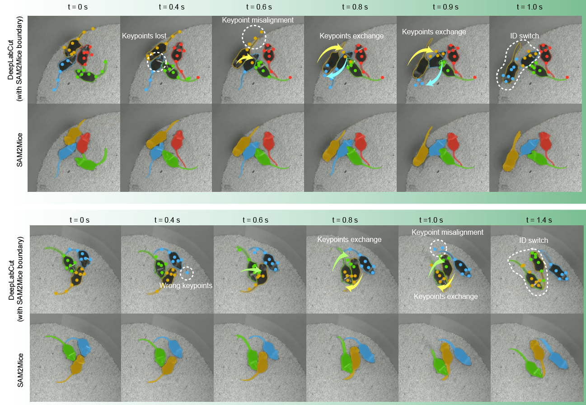

# SAM2Mice: a Zero shot, Multi-animal Semantic Segmentation Framework


[[`SAM 2 Paper`](https://arxiv.org/abs/2408.00714)] [[`YOLO v11 Paper`](https://www.arxiv.org/abs/2410.17725)] [[`BibTeX`](#citation)]


**SAM2Mice** extends the SAM2 foundation model to deliver zero-shot, high-accuracy multi-animal tracking and semantic segmentation, trained on a curated expert-labeled dataset spanning diverse experimental settings, and achieves state-of-the-art performance (86.7% Jaccard, 97.5% F1) with robust generalization across camera views, group interactions, complex environments, and long-duration recordings.

🔥 highlights:
- 🐭 Curated dataset: >4,500 frames & 13354 masklets from diverse experimental settings, annotated by >10 experts to finetune

- ⚡ Automated pipeline: integrates YOLOv11 prompt generation + bootstrapped inference for long recordings

- 📊 Benchmarks: Achieves near-perfect MOTA (0.979 / 0.958) on 3- and 5-mouse tasks, outperforming [SuperAnimal](https://www.nature.com/articles/s41467-024-48792-2) and [DeepLabCut](https://www.nature.com/articles/s41592-022-01443-0) by large margins


## Installation

Download the pretrained `SAM2Mice` checkpoints using gdown:

```bash
cd checkpoints
pip install gdown
bash download_ckpts.sh
```
or you could download directly from [google drive](https://drive.google.com/file/d/1ixrVMJ512o_Zm4C6GXqqs40AErYCH0_6/view?usp=drive_link).

Download the pretrained `YOLO v11` checkpoints, note that this ckpt only support top-down view in openfiled:

```bash
cd checkpoints_detection
bash download_ckpts.sh
```

Install PyTorch environment first. We use `python=3.11`, as well as `torch >= 2.6.0`, `torchvision>=0.21.0` and `cuda-12.4` in our environment to run this demo. Please follow the instructions [here](https://pytorch.org/get-started/locally/) to install both PyTorch and TorchVision dependencies. Installing both PyTorch and TorchVision with CUDA support is strongly recommended. You can easily install the latest version of PyTorch as follows:

```bash
pip install torch==2.6.0 torchvision==0.21.0 torchaudio==2.6.0 --index-url https://download.pytorch.org/whl/cu124
```

Install `Segment Anything 2`:

```bash
pip install -e .
python setup.py build_ext --inplace
```

Install `ultralytics`, `supervision`, `labelme`, `labelimg` and `scikit-learn`:

```bash
pip install ultralytics supervision labelme labelImg scikit-learn
```

## Training

The dataset used in SAM2Mice is currently not publicly available. It will be open-sourced after the paper is accepted and published.

### Data annotation pipeline

In the first step, we acquire a dataset encompassing a broad range of experimental conditions (e.g., standard home cages and naturalistic habitats, light and dark conditions, etc). Next, we apply the SAM2 in batch mode to generate semantic masks. In the third step, we systematically identify failure cases—such as identity loss and label mixing of the previous step. In the fourth step, a human annotator corrects these errors, and in the fifth step, an independent reviewer verifies the accuracy, quality, and completeness of all segmented masks. We iterate this pipeline through three to five rounds to ensure exhaustive coverage.


### Dataset prepare 

We use [**Labelme**](https://github.com/wkentaro/labelme) for mouse mask annotation.  Each frame is paired with a corresponding `.json` annotation file. The dataset directory structure should look like:  
```
├── Root folder
│ │ 
│ ├── <video_name_1>
│ │ ├── 00000.png
│ │ ├── 00000.json
│ │ ├── 00001.png
│ │ ├── 00001.json
│ │ └── ...
│ │ 
│ ├── <video_name_2>
│ │ ├── 00000.png
│ │ ├── 00000.json
│ │ ├── 00001.png
│ │ ├── 00001.json
│ │ └── ...
│ │ 
│ ├── <video_name_...>
│ 
```

We then convert the raw Labelme annotations into the [**MOSE**](https://github.com/henghuiding/MOSE-api) dataset format using the provided script:

```bash
cd training/dataset_pre
python labelme_to_training_format.py --json_dir <data_dir> --output_dir <output_dir>
```
This will generate the following directory structure:

```
├── Annotations
│ │ 
│ ├── <video_name_1>
│ │ ├── 00000.png
│ │ ├── 00001.png
│ │ └── ...
│ │ 
│ ├── <video_name_2>
│ │ ├── 00000.png
│ │ ├── 00001.png
│ │ └── ...
│ │ 
│ ├── <video_name_...>
│ 
└── JPEGImages
  │ 
  ├── <video_name_1>
  │ ├── 00000.jpg
  │ ├── 00001.jpg
  │ └── ...
  │ 
  ├── <video_name_2>
  │ ├── 00000.jpg
  │ ├── 00001.jpg
  │ └── ...
  │ 
  └── <video_name_...>
```

Examples of our dataset is like:


### Training script

We follow the original training script as SAM2, Please check the training [README](training/README.md) on how to get started.

### Data used to train YOLO v11

We convert the mask of SAM2Mice to bounding box to train a yolo detector for initial prompt generation, the bounding box data for YOLO could be downloaded from [google drive](https://drive.google.com/drive/folders/1aLM1k9hvZOTvQtgVzJ2K1oiGWzQ9MZNx?dmr=1&ec=wgc-drive-globalnav-goto).


You could run this to convert mask data from SAM2Mice to yolo format training data.
```bash
python SAM2_Mice/detection/train/mask_to_boxs.py \
    --video /path/to/video.mp4 \
    --pickle /path/to/processed_segments.pkl.gz \
    --images-out ./dataset/images \
    --labels-out ./dataset/labels \
    --mode random \
    --num-frames 200 \
    --class-mode single \
    --seed 42
```

Then you can train yolo from this script after modify the data path of [cfg](SAM2_Mice/detection/train/cfg/Airscope_five_mouse.yaml):
```bash
python SAM2_Mice/detection/train/train_detection.py
```

## SAM2Mice Demos

The data used in the demo could be downloaded from [google drive](https://drive.google.com/drive/folders/1HpAkDMQnqlLCBhCsW34AawSx-Fubtk57?dmr=1&ec=wgc-drive-globalnav-goto).

### Bootstrapping video predictor


Processing high-resolution, long-duration videos with SAM2 is GPU-intensive, since the default setting requires all frames to be loaded into memory (e.g., ~20 GB for a 1,000-frame video at 1224×1024 resolution). This becomes infeasible for experiments with tens of thousands of frames.  

To address this, **SAM2Mice** introduces a **bootstrapping strategy**:  
- The video is divided into multiple **overlapping batches** of `N+1` frames.  
- The extra `(N+1)`-th frame is duplicated as the **first frame of the next batch**.  
- This overlapping frame carries the **segmentation mask prompts** forward, enabling information transfer across batches.  


### Prompt-free segmentation 

Based on the strong tracking capability of SAM 2, we can combined it with YOLOv11 for prompt-free object segmentation and tracking. We've supported different types of prompt for Grounded SAM 2 tracking demo:

- **Point Prompt**: In order to **get a stable segmentation results**, we re-use the SAM 2 image predictor to get the prediction mask from each object based on YOLOv11 box outputs, then we **uniformly sample points from the prediction mask** as point prompts for SAM 2 video predictor
- **Box Prompt**: We directly use the box outputs from YOLOv11 as box prompts for SAM 2 video predictor
- **Mask Prompt**: We use the SAM 2 mask prediction results based on YOLOv11 box outputs as mask prompt for SAM 2 video predictor.


### Usage

After model definition, we need to extract frames first, the video is stored as a list of JPEG frames with filenames like **`<frame_index>.jpg`**. For bootstrapping stragety, the frames are saved at different batches folder, eg batch_1, batch_2.

```bash
from SAM2_Mice.segmentation import VideoSegmentationInference, BootstrappingVideoSegmentationInference

# Configuration
model_cfg = "configs/sam2.1/sam2.1_hiera_b+.yaml"
checkpoint_path = "checkpoints/SAM2_Mice_base_plus.pt"
VIDEO_PATH = "your_video_path"
FRAME_DIR = "your_frame_save_dir"

# 1. video predictor
SAM2_mice_predictor = VideoSegmentationInference(
    model_cfg=model_cfg,
    checkpoint_path=checkpoint,
)

inference.extract_frames_before_seg(video_path=VIDEO_PATH, frame_dir=FRAME_DIR )

# 2. bootstrapping video predictor
SAM2_mice_boots_predictor = BootstrappingVideoSegmentationInference(
    model_cfg=model_cfg,
    checkpoint_path=checkpoint,
)
SAM2_mice_boots_predictor.extract_bootstrapping_frames(video_path=VIDEO_PATH, batch_size=batch_size, batch_save_dir=FRAME_DIR )

```
Both **base** and **bootstrapping** modes support two prompt types:

- **Manual prompts**:  
  - Use [Labelme](https://github.com/wkentaro/labelme) to annotate the **any** frame you want. Pleas refer to [example.mp4](assets/labelme_usage_example.mp4) to see how to use labelme to give prompts in the directory frames extracted.
  - Example of a polygon prompt (`00000.json`):  
    ```json
    {
      "shapes": [
        {
          "label": "mouse",
          "points": [
            [424.51, 1120.64],
            [311.61, 1212.58],
            [208.38, 1254.51],
            [239.03, 1204.51]
          ],
          "group_id": 1,
          "shape_type": "polygon",
          "flags": {}
        }
      ]
    }
    ```

- **Detection prompts (prompt-free)**:  
  - Use **YOLOv11** to automatically detect animals in the **first frame**, which generates prompts in one of three formats:  
    - **Box prompts**  
    - **Point prompts**  
    - **Mask prompts**  

Then we can run the inference process like below. The results will be saved as follows in the save_dir: 
   - frames (folder): raw video frames with overlayed masks
   - prompts (folder): visualization of the frame you give prompt
   - segment_masks.pickle: store binary masks for each objects
   - segment_video.mp4: video overlayed with mask
  
```bash
SAM2_mice_predictor.run(
    video_path=None,
    frames_dir=FRAME_DIR,              # directory containing extracted frames (00000.jpg, 00001.jpg, ...)
    prompt_source="manual",             # "manual" or "detection"
    detection_ckpt_path="checkpoints/yolov11.pt",
    prompt_type="box",                     # "box", "point", or "mask"
    save_dir="results/base",
    fps=20,
)

SAM2_mice_boots_predictor.run_bootstrapping(
    video_path=None,
    frames_dir=FRAME_DIR,
    frame_interval=batch_size,                     
    extract_frame=False,                        # extract frames if not already done
    prompt_source="manual",                 # "manual" or "detection"
    detection_frame_idx=0,                     # index of first detection frame
    detection_ckpt_path="checkpoints/yolov11.pt",
    prompt_type="point",                        # "box", "point", or "mask"
    save_dir="results/bootstrapping",
    fps=20,
)
```


Please refer to the examples in [sam2_video_predictor.ipynb](./notebooks_SAM2-MICE/sam2_video_predictor.ipynb) for details on how to add prompts, make refinements, and track multiple objects in videos.

### Auto-Tracking with Dynamic IDs

This mode integrates YOLOv11 detection with SAM2Mice segmentation for fully automatic, prompt-free multi-animal tracking. It handles animal sequential appearance into the scenes. In this demo, we try to find new mouse and assign them with new ID across the whole video, this function is still under develop. it's not that stable now.


```bash
from SAM2_Mice.segmentation import auto_tracking_with_sam2

auto_tracking_with_sam2(
    video_path="data/test_video.mp4",
    frames_dir="data/frames",
    output_dir="results/tracking",
    sam2_checkpoint="checkpoints/SAM2_Mice_base_plus.pt",
    model_cfg="configs/sam2.1/sam2.1_hiera_b+.yaml",
    detection_ckpt_path="checkpoints/yolov11.pt",
    prompt_type="mask",                         # initial prompt type
    frame_step=1,                              # step size between frames
    frame_rate=20,                             # output fps
    detection_conf=0.5,                        # YOLOv11 confidence threshold
    iou_threshold=0.3,                         # for ID matching
    extract_frames=True,
    object_label="mouse",
)
```

Please refer to the examples in [sam2_video_predictor_tracking.ipynb](notebooks_SAM2-MICE/sam2_video_predictor_tracking.ipynb) for details.

## Tracking metrics evaluation 
This repo uses py-motmetrics to compute standard MOT metrics (MOTA, MOTP, IDF1, ID switches, FP, FN, etc.) from either:

- Keypoints HDF5: DLC-style multi-index DataFrame with coords x,y,likelihood per individual. We reconstruct per-individual boxes with a margin and average likelihood as confidence.
- YOLO label directories: A directory of per-frame .txt files (00000.txt, 00001.txt, …) with lines:
  class_id cx cy w h [optional_conf]
  plus a classes.txt. Boxes are normalized [0–1] and will be converted to pixels using the provided image width/height.

Please refer to [README.md](SAM2_Mice/benchmark/README.md) to download the evaluation data and see details in [bench_mark.ipynb](SAM2_Mice/benchmark/bench_mark.ipynb).

If you have packed binary masks per frame (processed_segments), convert them into YOLO boxes:

```bash
# Example
python -m SAM2_Mice.benchmark.mask_to_box_labelimg convert \
  --pickle /path/to/processed_segments.pkl \
  --out /path/to/SAM2_labels \
  --height 1024 --width 1224 \
  --format yolo \
  --min-area 900
```

Optionally visualize boxes over images:
```bash
python -m SAM2_Mice.benchmark.mask_to_box_labelimg vis \
  --images /path/to/images \
  --labels /path/to/SAM2_labels \
  --out /path/to/vis_out \
  --format yolo
```

Use compute_metrics.py to evaluate either:
- GT YOLO boxes dir vs Pred HDF5 keypoints (converted to boxes internally)

```bash

from SAM2_Mice.benchmark.compute_metrics import compute_mot_metrics
results, summary = compute_mot_metrics(
    gt_path="/path/to/gt_keypoints.h5",
    pred_path="/path/to/pred_keypoints.h5",
    tracker_type="bbox",
    margin=5.0,              # padding added around min/max keypoints
    match_in_first_frame=False,
    save_path="metrics_keypoints.pkl"
)
print(summary)
PY
```

- GT YOLO boxes dir vs Pred YOLO boxes dir (from masks).

```bash

from SAM2_Mice.benchmark.compute_metrics import compute_mot_metrics
# yolo_img_shape = (W, H) used to convert normalized coords → pixels
results, summary = compute_mot_metrics(
    gt_path="/path/to/GT_labels_yolo",
    pred_path="/path/to/SAM2_labels",
    tracker_type="bbox",
    yolo_img_shape=(1224, 1024),
    match_in_first_frame=False,
    save_path="metrics_sam2.pkl"
)
print(summary)
PY
```
We benchmarked SAM2Mice with SuperAnimal and DeepLabCut on 3 and 5 mice separately, compared with keypoints-based tracking methods: SAM2Mice provides richer spatial descriptions, greater noise robustness, and resistance to long duration drift.



the metrics are as follows:

### 🐭 3 mice openfield 

| Method          | MOTA (↑)         | FN (↓)              | Recall (↑)       | IDF1 (↑)         | ID switches (↓) | FM (↓)              |
|-----------------|------------------|---------------------|------------------|------------------|-----------------|---------------------|
| SuperAnimal   | 0.478 ± 0.040    | 276.3 ± 95.8        | 0.724 ± 0.095    | 0.395 ± 0.024    | 234.7 ± 56.9    | 54.7 ± 10.5         |
| DeepLabCut     | 0.881 ± 0.055    | 60.0 ± 27.7         | 0.940 ± 0.028    | 0.940 ± 0.027    | 0.0 ± 0.0       | 20.0 ± 2.9          |
| **SAM2Mice**    | **0.979 ± 0.029**| **10.3 ± 14.6**     | **0.990 ± 0.015**| **0.990 ± 0.015**| **0.0 ± 0.0**   | **2.3 ± 3.3**       |

---

### 🐭 5 mice openfield 

| Method          | MOTA (↑)         | FN (↓)              | Recall (↑)       | IDF1 (↑)         | ID switches (↓) | FM (↓)              |
|-----------------|------------------|---------------------|------------------|------------------|-----------------|---------------------|
| SuperAnimal   | 0.179 ± 0.016    | 863.0 ± 11.3        | 0.482 ± 0.008    | 0.183 ± 0.009    | 445.0 ± 31.4    | 218.0 ± 26.1        |
| DeepLabCut     | 0.703 ± 0.042    | 280.0 ± 56.4        | 0.832 ± 0.034    | 0.757 ± 0.109    | 4.3 ± 4.8       | 86.3 ± 1.9          |
| **SAM2Mice**    | **0.958 ± 0.026**| **34.7 ± 21.5**     | **0.979 ± 0.013**| **0.979 ± 0.013**| **0.0 ± 0.0**   | **12.3 ± 4.7**      |


### Citation

If you find this project helpful for your research, please consider citing the following BibTeX entry.

```BibTex
@misc{ravi2024sam2segmentimages,
      title={SAM 2: Segment Anything in Images and Videos}, 
      author={Nikhila Ravi and Valentin Gabeur and Yuan-Ting Hu and Ronghang Hu and Chaitanya Ryali and Tengyu Ma and Haitham Khedr and Roman Rädle and Chloe Rolland and Laura Gustafson and Eric Mintun and Junting Pan and Kalyan Vasudev Alwala and Nicolas Carion and Chao-Yuan Wu and Ross Girshick and Piotr Dollár and Christoph Feichtenhofer},
      year={2024},
      eprint={2408.00714},
      archivePrefix={arXiv},
      primaryClass={cs.CV},
      url={https://arxiv.org/abs/2408.00714}, 
}


```
