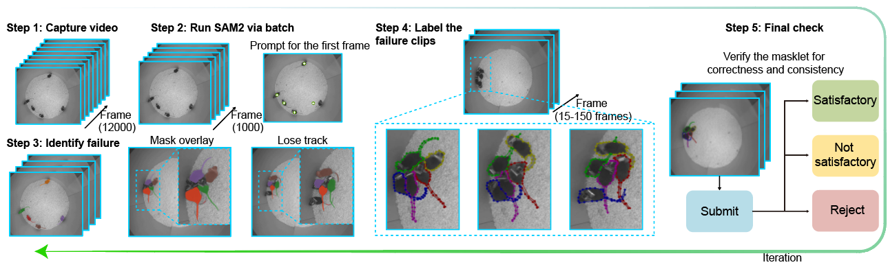
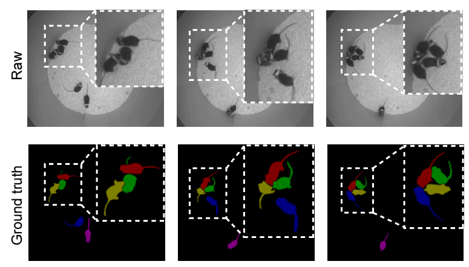

# Training Code for SAM 2

This folder contains the training code for SAM 2, a foundation model for promptable visual segmentation in images and videos. 
The code allows users to train and fine-tune SAM 2 on their own datasets (image, video, or both).

## Structure

The training code is organized into the following subfolders:

* `dataset`: This folder contains image and video dataset and dataloader classes as well as their transforms.
* `model`: This folder contains the main model class (`SAM2Train`) for training/fine-tuning. `SAM2Train` inherits from `SAM2Base` model and provides functions to enable training or fine-tuning SAM 2. It also accepts all training-time parameters used for simulating user prompts (e.g. iterative point sampling).
* `utils`: This folder contains training utils such as loggers and distributed training utils.
* `scripts`: This folder contains the script to extract the frames of SA-V dataset to be used in training.
* `loss_fns.py`: This file has the main loss class (`MultiStepMultiMasksAndIous`) used for training.
* `optimizer.py`:  This file contains all optimizer utils that support arbitrary schedulers.
* `trainer.py`: This file contains the `Trainer` class that accepts all the `Hydra` configurable modules (model, optimizer, datasets, etc..) and implements the main train/eval loop.
* `train.py`: This script is used to launch training jobs. It supports single and multi-node jobs. For usage, please check the [Getting Started](README.md#getting-started) section or run `python training/train.py -h`

## Getting Started

The dataset used in SAM2Mice is currently not publicly available. It will be open-sourced after the paper is accepted and published.

We provide fine-tuning configs for the SAM 2.1 models on the Airscope (SAM2Mice) dataset. The available configs are:

| Config | Model | Checkpoint |
|--------|-------|------------|
| `configs/sam2.1_training/sam2.1_hiera_b+_Airscope_finetune.yaml` | Hiera Base+ | `checkpoints/sam2.1_hiera_base_plus.pt` |
| `configs/sam2.1_training/sam2.1_hiera_s_Airscope_finetune.yaml` | Hiera Small | `checkpoints/sam2.1_hiera_small.pt` |
| `configs/sam2.1_training/sam2.1_hiera_l_Airscope_finetune.yaml` | Hiera Large | `checkpoints/sam2.1_hiera_large.pt` |

#### Requirements:
- We assume training on A100 GPUs with **80 GB** of memory.
- Download the SAM2Mice training dataset and set the correct paths in the config file.

#### Steps to fine-tune on Airscope (SAM2Mice) dataset:
- Install the packages required for training by running `pip install -e ".[dev]"`.
- Set the paths for the dataset in `configs/sam2.1_training/sam2.1_hiera_b+_Airscope_finetune.yaml` (or the `_s_` / `_l_` variants):
    ```yaml
    dataset:
        img_folder: /path/to/SAM2Mice_training_dataset/JPEGImages
        gt_folder: /path/to/SAM2Mice_training_dataset/Annotations
        file_list_txt: /path/to/SAM2Mice_training_dataset/train_list.txt
    ```
- To fine-tune using all available GPUs, run:

    ```bash
    python training/train.py \
        -c configs/sam2.1_training/sam2.1_hiera_b+_Airscope_finetune.yaml \
        --use-cluster 0 \
        --num-gpus 8
    ```

- To specify which GPUs to use, set `CUDA_VISIBLE_DEVICES` before the command:

    ```bash
    # Use GPUs 0 and 1 only
    CUDA_VISIBLE_DEVICES=0,1 python training/train.py \
        -c configs/sam2.1_training/sam2.1_hiera_b+_Airscope_finetune.yaml \
        --use-cluster 0 \
        --num-gpus 2

    # Use a single GPU (GPU 2)
    CUDA_VISIBLE_DEVICES=2 python training/train.py \
        -c configs/sam2.1_training/sam2.1_hiera_b+_Airscope_finetune.yaml \
        --use-cluster 0 \
        --num-gpus 1

    # Use GPUs 4, 5, 6, 7
    CUDA_VISIBLE_DEVICES=4,5,6,7 python training/train.py \
        -c configs/sam2.1_training/sam2.1_hiera_b+_Airscope_finetune.yaml \
        --use-cluster 0 \
        --num-gpus 4
    ```

    Note: `--num-gpus` must match the number of GPUs listed in `CUDA_VISIBLE_DEVICES`.

    We also support multi-node training on a cluster using [SLURM](https://slurm.schedmd.com/documentation.html), for example, training on 2 nodes:

    ```bash
    python training/train.py \
        -c configs/sam2.1_training/sam2.1_hiera_b+_Airscope_finetune.yaml \
        --use-cluster 1 \
        --num-gpus 8 \
        --num-nodes 2 \
        --partition $PARTITION \
        --qos $QOS \
        --account $ACCOUNT
    ```
    where partition, qos, and account are optional and depend on your SLURM configuration.

    By default, checkpoints and logs are saved under `sam2_logs/` in the repo root. You can override this in the config:

    ```yaml
    launcher:
      experiment_log_dir: /path/to/your/log/dir  # defaults to ./sam2_logs/${config_name}
    ```

    Training losses can be monitored via `tensorboard` logs stored under `tensorboard/` in the experiment log directory.

    After training/fine-tuning, the new checkpoint (saved in `checkpoints/` in the experiment log directory) can be used as a drop-in replacement for SAM 2.1 released checkpoints.

## SAM2Mice Dataset Preparation

### Data Annotation Pipeline

In the first step, we acquire a dataset encompassing a broad range of experimental conditions, including standard home cages, naturalistic habitats, light conditions, and dark conditions. Next, we apply SAM2 in batch mode to generate semantic masks. We then identify failure cases such as identity loss and label mixing. A human annotator corrects these errors, and an independent reviewer verifies the accuracy, quality, and completeness of the masks. We iterate this pipeline three to five times to improve coverage.



### LabelMe Dataset Format

We use [LabelMe](https://github.com/wkentaro/labelme) for mouse mask annotation. Each frame is paired with a corresponding `.json` annotation file:

An example annotated dataset can be downloaded from [Google Drive](https://drive.google.com/file/d/1jCTJk6LRsQnCCKe7qJGZnsDLCochzUym/view?usp=drive_link). The original full SAM2Mice dataset will be open-sourced in the future.

For an advanced VOS inference example, see [`notebooks_SAM2-MICE/05_vos_inference_advanced.ipynb`](../notebooks_SAM2-MICE/05_vos_inference_advanced.ipynb).

<details>
<summary>Raw LabelMe dataset directory</summary>

```text
Root folder
├── <video_name_1>
│   ├── 00000.png
│   ├── 00000.json
│   ├── 00001.png
│   ├── 00001.json
│   └── ...
├── <video_name_2>
│   ├── 00000.png
│   ├── 00000.json
│   ├── 00001.png
│   ├── 00001.json
│   └── ...
└── ...
```

</details>

Convert the raw LabelMe annotations into the [MOSE](https://github.com/henghuiding/MOSE-api) dataset format:

```bash
cd training/dataset_pre
python labelme_to_training_format.py --json_dir <data_dir> --output_dir <output_dir>
```

The converted dataset should contain:

<details>
<summary>Converted MOSE-style dataset directory</summary>

```text
<output_dir>
├── Annotations
│   ├── <video_name_1>
│   │   ├── 00000.png
│   │   ├── 00001.png
│   │   └── ...
│   └── ...
└── JPEGImages
    ├── <video_name_1>
    │   ├── 00000.jpg
    │   ├── 00001.jpg
    │   └── ...
    └── ...
```

</details>

Example dataset:

<p align="center">
  
</p>

## YOLOv11 Detector Training

We convert SAM2Mice masks to bounding boxes to train a YOLO detector for initial prompt generation. The bounding box data for YOLO can be downloaded from [Google Drive](https://drive.google.com/drive/folders/1aLM1k9hvZOTvQtgVzJ2K1oiGWzQ9MZNx?dmr=1&ec=wgc-drive-globalnav-goto).

Convert packed SAM2Mice mask data to YOLO-format training data:

```bash
python SAM2_Mice/detection/train/mask_to_box.py \
    --video /path/to/video.mp4 \
    --pickle /path/to/processed_segments.pkl.gz \
    --images-out ./dataset/images \
    --labels-out ./dataset/labels \
    --mode random \
    --num-frames 200 \
    --class-mode single \
    --seed 42
```

Then edit the dataset paths in [`SAM2_Mice/detection/train/cfg/Airscope_five_mouse.yaml`](../SAM2_Mice/detection/train/cfg/Airscope_five_mouse.yaml) and run:

```bash
python SAM2_Mice/detection/train/train_detection.py
```

## Training on images and videos
The code supports training on images and videos (similar to how SAM 2 is trained). We provide classes for loading SA-1B as a sample image dataset, SA-V as a sample video dataset, as well as any DAVIS-style video dataset (e.g. MOSE). Note that to train on SA-V, you must first extract all videos to JPEG frames using the provided extraction [script](./scripts/sav_frame_extraction_submitit.py). Below is an example of how to setup the datasets in your config to train on a mix of image and video datasets:

```yaml
data:
  train:
    _target_: training.dataset.sam2_datasets.TorchTrainMixedDataset 
    phases_per_epoch: ${phases_per_epoch} # Chunks a single epoch into smaller phases
    batch_sizes: # List of batch sizes corresponding to each dataset
    - ${bs1} # Batch size of dataset 1
    - ${bs2} # Batch size of dataset 2
    datasets:
    # SA1B as an example of an image dataset
    - _target_: training.dataset.vos_dataset.VOSDataset
      training: true
      video_dataset:
        _target_: training.dataset.vos_raw_dataset.SA1BRawDataset
        img_folder: ${path_to_img_folder}
        gt_folder: ${path_to_gt_folder}
        file_list_txt: ${path_to_train_filelist} # Optional
      sampler:
        _target_: training.dataset.vos_sampler.RandomUniformSampler
        num_frames: 1
        max_num_objects: ${max_num_objects_per_image}
      transforms: ${image_transforms}
    # SA-V as an example of a video dataset
    - _target_: training.dataset.vos_dataset.VOSDataset
      training: true
      video_dataset:
        _target_: training.dataset.vos_raw_dataset.JSONRawDataset
        img_folder: ${path_to_img_folder}
        gt_folder: ${path_to_gt_folder}
        file_list_txt: ${path_to_train_filelist} # Optional
        ann_every: 4
      sampler:
        _target_: training.dataset.vos_sampler.RandomUniformSampler
        num_frames: 8 # Number of frames per video
        max_num_objects: ${max_num_objects_per_video}
        reverse_time_prob: ${reverse_time_prob} # probability to reverse video
      transforms: ${video_transforms}
    shuffle: True
    num_workers: ${num_train_workers}
    pin_memory: True
    drop_last: True
    collate_fn:
    _target_: training.utils.data_utils.collate_fn
    _partial_: true
    dict_key: all
```
